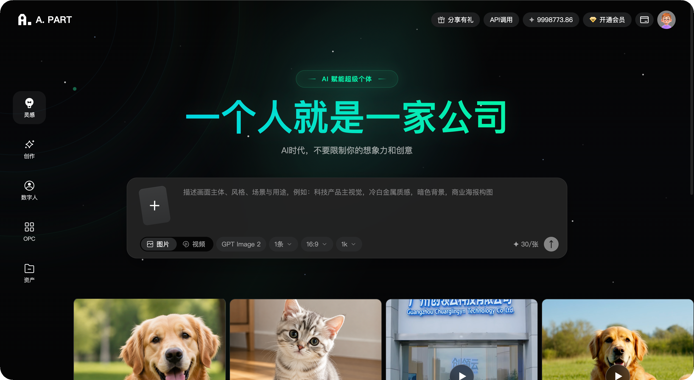

<p align="center">
  
</p>

<h1 align="center">LikeAdmin AIGC SaaS</h1>

<p align="center">
  面向 AI 时代的应用生产基础设施，把模型能力、应用市场、租户运营、点数计费、内容生成和持续更新整合到同一套系统。
</p>

<p align="center">
  <a href="https://api.likeadmin.cn"><strong>api.likeadmin.cn 算力超市</strong></a>
  ·
  <a href="https://likeadmin.cn"><strong>likeadmin.cn 免费开源框架</strong></a>
</p>

<p align="center">
  <strong>AI 应用聚合平台</strong> ·
  <strong>企业私有 AI 门户</strong> ·
  <strong>数字人生产平台</strong> ·
  <strong>内容商业化系统</strong>
</p>

---

LikeAdmin AIGC SaaS 不是一套普通后台，而是一套可部署、可更新、可运营的 AI 商业底座。它适合用来搭建 AIGC 聚合平台、企业私有 AI 门户、行业模型应用市场、数字人生产平台、AI 内容商业化系统、会员制智能工具站，以及面向政企、教育、电商、传媒、本地生活等行业的专属智能服务平台。

系统上游连接模型与算力，下游连接客户、场景、权益和收入，中间沉淀可复用的应用、数据、权限、账单和运营能力。下一代平台的价值不在于接入多少个模型，而在于能否把模型能力组织成可交付、可计费、可增长的生意。

商务与技术支持：18786709420。

## 核心能力

- 多租户 SaaS 架构，支持平台、租户、用户多角色协作。
- 内置图片、视频、数字人、智能画布、LLM 等 AIGC 应用能力。
- 支持应用中心、应用启停、租户授权、菜单权限和前端入口管理。
- 支持点数计费、会员套餐、充值、消耗记录和业务闭环。
- 支持平台后台、租户后台、PC 前台、H5 与微信小程序多端交付。
- 支持云端系统更新、私有更新源、版本签名校验和长任务更新流程。
- 支持本地化部署，便于企业掌控数据、密钥、模型通道和商业策略。

## 运行环境

- Linux / 宝塔 / Docker 均可部署，推荐 Nginx + PHP-FPM。
- PHP >= 8.0，需启用 `curl`、`zip`、`fileinfo`、`openssl`、`mbstring`、`pdo_mysql`、`iconv` 等扩展。
- MySQL >= 5.7 或 MariaDB >= 10.3，字符集建议 `utf8mb4`。
- Composer 2.x。
- Web 目录指向 `server/public`。
- 需要在线更新和解压更新包时，服务器需支持 `ZipArchive`，或安装 `unzip` / `7z` / `tar` 命令之一。

## 目录说明

```text
server/
├── app/                    # 后端业务代码，含 platformapi、tenantapi、api 和内置应用
├── config/                 # ThinkPHP 配置
├── extend/                 # 扩展类库
├── public/                 # Web 入口和前端构建产物
│   ├── admin/              # 租户后台
│   ├── platform/           # 平台后台
│   ├── pc/                 # PC 前台
│   ├── mobile/             # H5
│   ├── mp-weixin/          # 微信小程序
│   └── install/            # Web 安装器
├── route/                  # 路由配置
├── runtime/                # 缓存、日志、临时文件，需可写
├── upgrade/                # 老版本更新包临时目录，需可写
├── vendor/                 # Composer 依赖
├── .example.env            # 环境变量模板
├── composer.json
└── think                   # 命令行入口
```

## 全新安装

1. 上传或拉取代码到服务器，例如 `/www/wwwroot/likeadmin_aigc_saas/server`。
2. 将站点运行目录设置为 `server/public`，不要直接暴露 `server` 根目录。
3. 安装依赖：

```bash
cd /www/wwwroot/likeadmin_aigc_saas/server
composer install --no-dev --optimize-autoloader
```

4. 配置目录权限：

```bash
chmod -R 755 .
chmod -R 777 runtime public/uploads upgrade
```

5. 复制环境文件并按实际情况修改数据库、域名等配置：

```bash
cp .example.env .env
```

关键配置示例：

```ini
[DATABASE]
HOSTNAME = 127.0.0.1
DATABASE = likeadmin_aigc_saas
USERNAME = root
PASSWORD =
HOSTPORT = 3306
PREFIX = la_

[PROJECT]
HTTP_HOST = your-domain.com
UNIQUE_IDENTIFICATION = likeadmin_aigc_saas
DEFAULT_PASSWORD = 123456
```

6. 导入数据库。可通过浏览器访问安装器，也可手动导入：

```bash
mysql -uroot -p likeadmin_aigc_saas < public/install/db/like.sql
```

7. 配置伪静态。Nginx 示例：

```nginx
location / {
    if (!-e $request_filename) {
        rewrite ^(.*)$ /index.php?s=$1 last;
        break;
    }
}

location ~ \.php$ {
    fastcgi_pass 127.0.0.1:9000;
    fastcgi_index index.php;
    include fastcgi_params;
    fastcgi_param SCRIPT_FILENAME $document_root$fastcgi_script_name;
}
```

8. 访问入口：

- 平台后台：`https://your-domain.com/platform/`
- 租户后台：`https://your-domain.com/admin/`
- PC 前台：`https://your-domain.com/pc/`
- H5：`https://your-domain.com/mobile/`

## Docker / 宝塔部署提示

- 宝塔环境中建议 PHP 版本选择 8.0 或更高，并在 PHP 管理中启用所需扩展。
- Docker 环境需将 `server/public` 映射为 Web 根目录，并持久化 `server/runtime`、`server/public/uploads`、`server/public/storage`。
- 生产环境关闭调试：`.env` 中保持 `APP_DEBUG = false`。
- 如开启在线更新，需确保 PHP 进程对 `server`、`runtime`、`upgrade` 和前端构建目录有写入权限。

## 更新与发布

平台后台提供系统更新能力，更新包会经过下载、预检、签名校验、SQL 执行和文件替换流程。大版本更新前请先完成：

- 备份数据库。
- 备份 `server/.env`、`server/public/uploads`、`server/runtime` 等运行数据。
- 确认磁盘剩余空间不小于更新包体积的 3 倍。
- 确认 `ZipArchive` 或 `unzip` / `7z` / `tar` 可用。

本项目的系统更新请求和服务端执行超时已按长任务处理，默认允许 10 分钟完成下载、预检和写入。

## 常用命令

```bash
# 清理缓存
php think clear

# 发现服务
php think service:discover

# 重新发布扩展资源
php think vendor:publish

# 检查 PHP 语法
php -l app/common/service/update/SystemPackageUpdateService.php
```

## 安全建议

- 不要提交或分发 `.env`、`config/install.lock`、`runtime/`、`public/uploads/` 中的运行数据。
- 管理员默认密码仅用于初始化，首次登录后请立即修改。
- 生产环境建议开启 HTTPS，并限制平台后台访问来源。
- 第三方 AI 通道、短信、支付、对象存储等密钥请通过后台配置或安全环境变量保存。

## 联系我们

我们提供部署、二开、AIGC 应用接入、私有化更新源、商业授权与运营陪跑服务。如果你要做的不只是一个工具站，而是一个能够持续生长的 AI 平台，可以直接联系。

联系电话：18786709420
