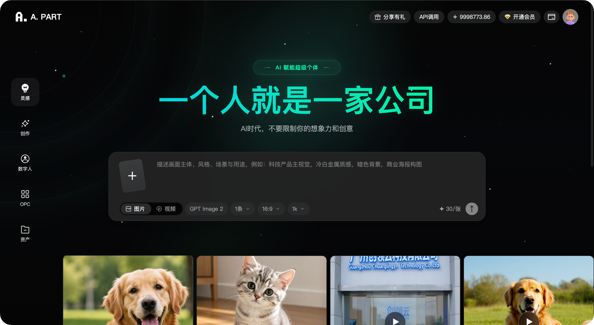

<p align="center">
  
</p>

<h1 align="center">LikeAdmin AIGC SaaS</h1>

<p align="center">
  面向 AI 时代的应用生产基础设施，把模型能力、应用市场、租户运营、点数计费、内容生成和持续更新整合到同一套系统。
</p>

<p align="center">
  <a href="https://api.likeadmin.cn"><strong>api.likeadmin.cn 算力超市</strong></a>
  ·
  <a href="https://mp.weixin.qq.com/s/FNEqnnG6IWGotshb2ITgXQ"><strong>算力超市怎么做？</strong></a>
  ·
  <a href="https://likeadmin.cn"><strong>likeadmin.cn 免费开源框架</strong></a>
</p>

<p align="center">
  <strong>AI 应用聚合平台</strong> ·
  <strong>企业私有 AI 门户</strong> ·
  <strong>数字人生产平台</strong> ·
  <strong>内容商业化系统</strong>
</p>

---

LikeAdmin AIGC SaaS 不是一套普通后台，而是一套可部署、可更新、可运营的 AI 商业底座。它适合用来搭建 AIGC 聚合平台、企业私有 AI 门户、行业模型应用市场、数字人生产平台、AI 内容商业化系统、会员制智能工具站，以及面向政企、教育、电商、传媒、本地生活等行业的专属智能服务平台。

系统上游连接模型与算力，下游连接客户、场景、权益和收入，中间沉淀可复用的应用、数据、权限、账单和运营能力。下一代平台的价值不在于接入多少个模型，而在于能否把模型能力组织成可交付、可计费、可增长的生意。

商务与技术支持：18786709420。

## 核心能力

- 多租户 SaaS 架构，支持平台、租户、用户多角色协作。
- 内置图片、视频、数字人、智能画布、LLM 等 AIGC 应用能力。
- 支持应用中心、应用启停、租户授权、菜单权限和前端入口管理。
- 支持点数计费、会员套餐、充值、消耗记录和业务闭环。
- 支持平台后台、租户后台、PC 前台、H5 与微信小程序多端交付。
- 支持云端系统更新、私有更新源、版本签名校验和长任务更新流程。
- 支持本地化部署，便于企业掌控数据、密钥、模型通道和商业策略。

## 运行环境

- Linux / 宝塔 / Docker 均可部署，推荐 Nginx + PHP-FPM。
- PHP >= 8.0，需启用 `curl`、`zip`、`fileinfo`、`openssl`、`mbstring`、`pdo_mysql`、`iconv` 等扩展。
- MySQL >= 5.7 或 MariaDB >= 10.3，字符集建议 `utf8mb4`。
- Composer 2.x。
- Web 目录指向 `server/public`。
- 需要在线更新和解压更新包时，服务器需支持 `ZipArchive`，或安装 `unzip` / `7z` / `tar` 命令之一。

## 目录说明

```text
server/
├── app/                    # 后端业务代码，含 platformapi、tenantapi、api 和内置应用
├── config/                 # ThinkPHP 配置
├── extend/                 # 扩展类库
├── public/                 # Web 入口和前端构建产物
│   ├── admin/              # 租户后台
│   ├── platform/           # 平台后台
│   ├── pc/                 # PC 前台
│   ├── mobile/             # H5
│   ├── mp-weixin/          # 微信小程序
│   └── install/            # Web 安装器
├── route/                  # 路由配置
├── runtime/                # 缓存、日志、临时文件，需可写
├── upgrade/                # 老版本更新包临时目录，需可写
├── vendor/                 # Composer 依赖
├── .example.env            # 环境变量模板
├── composer.json
└── think                   # 命令行入口
```

## 全新安装

1. 上传或拉取代码到服务器，例如 `/www/wwwroot/likeadmin_aigc_saas/server`。
2. 将站点运行目录设置为 `server/public`，不要直接暴露 `server` 根目录。
3. 安装依赖：

```bash
cd /www/wwwroot/likeadmin_aigc_saas/server
composer install --no-dev --optimize-autoloader
```

4. 配置目录权限：

```bash
chmod -R 755 .
chmod -R 777 runtime public/uploads upgrade
```

5. 复制环境文件并按实际情况修改数据库、域名等配置：

```bash
cp .example.env .env
```

关键配置示例：

```ini
[DATABASE]
HOSTNAME = 127.0.0.1
DATABASE = likeadmin_aigc_saas
USERNAME = root
PASSWORD =
HOSTPORT = 3306
PREFIX = la_

[PROJECT]
HTTP_HOST = your-domain.com
UNIQUE_IDENTIFICATION = likeadmin_aigc_saas
DEFAULT_PASSWORD = 123456
```

6. 导入数据库。可通过浏览器访问安装器，也可手动导入：

```bash
mysql -uroot -p likeadmin_aigc_saas < public/install/db/like.sql
```

7. 配置伪静态。Nginx 示例：

```nginx
location / {
    if (!-e $request_filename) {
        rewrite ^(.*)$ /index.php?s=$1 last;
        break;
    }
}

location ~ \.php$ {
    fastcgi_pass 127.0.0.1:9000;
    fastcgi_index index.php;
    include fastcgi_params;
    fastcgi_param SCRIPT_FILENAME $document_root$fastcgi_script_name;
}
```

8. 访问入口：

- 平台后台：`https://your-domain.com/platform/`
- 租户后台：`https://your-domain.com/admin/`
- PC 前台：`https://your-domain.com/pc/`
- H5：`https://your-domain.com/mobile/`

## Docker Compose 部署

仓库已经提供生产可用的 `Dockerfile` 和 `docker-compose.yml`。Docker 部署只使用当前开源仓库，镜像内包含已编译的管理后台、PC 和 H5 资源，不需要获取前端源码仓库，也不需要在服务器安装 Node.js。

### 运行要求

- Docker Engine 24 或更高版本。
- Docker Compose 2.20 或更高版本，需支持 `service_completed_successfully`。
- 建议至少 2 核 CPU、4 GB 内存和 10 GB 可用磁盘。
- 域名部署需提前解析主域名；多租户子域名模式还需配置泛域名解析。

### 1. 拉取开源代码

在准备部署的服务器上执行：

```bash
git clone --branch master --single-branch https://gitee.com/likeadmin/likeadmin-aigc.git
cd likeadmin-aigc
```

后面的命令都必须在 `likeadmin-aigc` 仓库根目录执行，也就是能看到 `Dockerfile`、`docker-compose.yml` 和 `.env.docker.example` 的目录。

Docker 镜像只使用这个开源仓库的内容。仓库已经包含平台后台、租户后台、PC 和 H5 的编译产物，不需要拉取非开源前端仓库，也不需要安装 Node.js。

### 2. 检查 Docker 环境

```bash
docker --version
docker compose version
```

两个命令都应正常显示版本。请使用 `docker compose`（中间有空格）的 Compose V2，不要使用已经停止维护的 `docker-compose` V1。尚未安装 Docker 时，请先按 [Docker Engine 官方安装文档](https://docs.docker.com/engine/install/) 完成安装，并确保当前用户有权限执行 Docker 命令。

### 3. 创建部署配置

在仓库根目录执行：

```bash
cp .env.docker.example .env.docker
chmod 600 .env.docker
```

使用 `nano .env.docker`、`vim .env.docker` 或其他文本编辑器打开配置文件。所有以 `CHANGE_ME` 开头的值都必须替换，不能直接使用模板值。

可以执行下面的命令生成一组不含特殊符号的随机值：

```bash
printf 'MYSQL_PASSWORD='; openssl rand -hex 24
printf 'MYSQL_ROOT_PASSWORD='; openssl rand -hex 24
printf 'PROJECT_UNIQUE_IDENTIFICATION='; openssl rand -hex 32
printf 'PROJECT_DEFAULT_PASSWORD='; openssl rand -hex 12
printf 'PLATFORM_ADMIN_PASSWORD='; openssl rand -hex 12
```

命令会输出 5 行可直接使用的配置。将每行等号后面的随机字符串填入 `.env.docker` 对应位置，并把这些值保存在密码管理器中。`MYSQL_PASSWORD` 和 `MYSQL_ROOT_PASSWORD` 应使用不同的值。

关键配置：

| 配置项 | 说明 |
| --- | --- |
| `HTTP_PORT` | 映射到服务器的 HTTP 端口，默认 `8080`；端口被占用时可改为其他未占用端口 |
| `MYSQL_DATABASE` | 应用数据库名，通常保持默认的 `likeadmin_aigc_saas` |
| `MYSQL_USER` | 应用连接数据库使用的普通账号，通常保持默认的 `likeadmin` |
| `MYSQL_PASSWORD` | `MYSQL_USER` 对应的数据库密码，仅供容器内部连接数据库，不是后台登录密码 |
| `MYSQL_ROOT_PASSWORD` | MySQL Root 管理密码，仅用于数据库维护和备份，不是后台登录密码 |
| `PROJECT_UNIQUE_IDENTIFICATION` | 系统密码哈希密钥，不是登录密码；首次安装后必须永久保持不变 |
| `PROJECT_HTTP_HOST` | 实际访问系统的域名或服务器 IP，不要填写 `http://`、`https://` 或路径 |
| `PROJECT_DEFAULT_PASSWORD` | 平台以后新建租户管理员时使用的默认登录密码，请勿与平台管理员密码相同 |
| `PLATFORM_ADMIN_USER` | 首次安装时自动创建的平台管理员账号，例如 `admin` |
| `PLATFORM_ADMIN_PASSWORD` | 首次安装时自动创建的平台管理员登录密码，至少 12 位 |

#### `PROJECT_UNIQUE_IDENTIFICATION` 是什么

它可以理解为“本套系统专用的永久随机密钥”，不是任何人的登录密码。系统不会直接保存用户输入的明文密码，而是把用户密码和这个随机密钥一起计算后保存。因此，即使两套系统使用了相同的登录密码，数据库中保存的结果也不同。

需要特别注意：

1. 首次安装前随机生成一次即可，建议使用上面的 `openssl rand -hex 32`。
2. 安装完成后不能修改。修改后，平台管理员、租户管理员和用户原有密码都会校验失败。
3. 它不能用于登录，也不需要提供给普通用户。
4. 备份数据库时必须同时安全备份 `.env.docker`。只备份数据库、不保存这个值，恢复后原有账号密码将无法正常验证。

#### `PROJECT_HTTP_HOST` 怎么填写

- 使用正式域名访问：填写域名，例如 `aigc.example.com`。
- 暂时使用服务器 IP 访问：填写服务器 IP，例如 `203.0.113.10`。
- 只在服务器本机浏览器测试：可以填写 `localhost`。
- 需要允许多个平台域名时可用英文逗号分隔，例如 `aigc.example.com,203.0.113.10`。

如果你在自己电脑上通过服务器 IP 访问，就不能保留模板中的 `localhost`。配置错误时，静态页面可能可以打开，但登录或 API 会提示域名错误。

一个需要手动确认的配置结构如下，等号右侧应替换为你自己的真实值：

```dotenv
COMPOSE_PROJECT_NAME=likeadmin-aigc
HTTP_PORT=8080
TZ=Asia/Shanghai

MYSQL_DATABASE=likeadmin_aigc_saas
MYSQL_USER=likeadmin
MYSQL_PASSWORD=替换为随机生成的数据库密码
MYSQL_ROOT_PASSWORD=替换为另一个随机数据库密码

PROJECT_UNIQUE_IDENTIFICATION=替换为随机生成的永久密钥
PROJECT_HTTP_HOST=替换为实际域名或服务器IP
PROJECT_DEFAULT_PASSWORD=替换为租户管理员默认密码

PLATFORM_ADMIN_USER=admin
PLATFORM_ADMIN_PASSWORD=替换为平台管理员密码
```

`.env.docker` 已加入 Git 忽略规则，不要将真实密码提交到仓库。

### 4. 校验配置

```bash
# 只校验配置，不输出密码
docker compose --env-file .env.docker config --quiet
```

命令没有任何输出并返回命令提示符，表示 Compose 配置格式正确。不要把 `--quiet` 去掉后将完整输出发到公开场合，因为完整配置中可能包含数据库密码。

### 5. 构建并启动

```bash
docker compose --env-file .env.docker up -d --build
```

首次启动需要下载 MySQL、Redis、Nginx、PHP 基础镜像，并安装 PHP 扩展、Composer 依赖和 FFmpeg，耗时取决于服务器网络和性能。命令执行结束且没有报错后，查看全部容器状态：

```bash
docker compose --env-file .env.docker ps -a
```

首次启动会自动完成以下操作：

1. 创建 MySQL、Redis、运行目录、上传目录和本地存储数据卷。
2. 仅在 MySQL 数据卷为空时导入 `public/install/db/like.sql`。
3. 运行一次性 `initialize` 服务，按配置创建平台管理员。
4. 数据库和初始化检查通过后，再启动 PHP-FPM、Nginx、AI Worker 和定时任务。

正常情况下，`mysql`、`redis`、`app`、`web`、`ai-worker`、`canvas-worker`、`scheduler` 会显示 `Up` 或 `healthy`；一次性服务 `initialize` 显示 `Exited (0)` 是正常状态。

`initialize` 在已有管理员时不会重置账号或密码。数据库卷创建完成后，再修改 `.env.docker` 中的 `PLATFORM_ADMIN_USER` 或 `PLATFORM_ADMIN_PASSWORD`，不会修改数据库里的现有管理员。

### 6. 启动失败时查看日志

某个容器没有正常启动时，先查看全部状态，再查看对应日志：

```bash
docker compose --env-file .env.docker ps -a
docker compose --env-file .env.docker logs --tail=200 mysql initialize app web ai-worker canvas-worker scheduler
```

常见问题：

- 提示端口已被占用：修改 `.env.docker` 中的 `HTTP_PORT` 后重新启动。
- 镜像或软件包下载超时：检查服务器访问 Docker Hub、Debian 和 Composer 软件源的网络。
- `initialize` 退出码不是 `0`：重点检查数据库密码是否填写完整，以及所有 `CHANGE_ME` 是否已替换。
- 页面能打开但登录提示域名错误：检查 `PROJECT_HTTP_HOST` 是否与浏览器使用的域名或 IP 一致。
- 外网无法访问：检查云服务器安全组和系统防火墙是否放行 `HTTP_PORT`。

修改配置后可执行下面的命令重新创建服务：

```bash
docker compose --env-file .env.docker up -d --force-recreate
```

### 7. 访问系统和首次登录

默认端口为 `8080`：

- 平台后台：`http://服务器IP:8080/platform/`
- 租户后台：`http://服务器IP:8080/admin/`
- PC 前台：`http://服务器IP:8080/pc/`
- H5：`http://服务器IP:8080/mobile/`

如果 `HTTP_PORT=80`，访问地址中可以省略 `:80`。使用域名时，把“服务器IP”换成 `PROJECT_HTTP_HOST` 中配置的域名。

首次登录平台后台使用 `.env.docker` 中的 `PLATFORM_ADMIN_USER` 和 `PLATFORM_ADMIN_PASSWORD`。这是平台总后台账号，不是 MySQL 账号。租户后台账号需要登录平台后台后创建租户时生成。

### 容器说明

| 服务 | 作用 |
| --- | --- |
| `web` | Nginx、静态资源、SPA 路由和 PHP 转发 |
| `app` | ThinkPHP PHP-FPM API |
| `mysql` | MySQL 8.0 数据库 |
| `redis` | 共享缓存 |
| `ai-worker` | 异步查询 AI 任务结果、资源转存、结算和退款 |
| `canvas-worker` | 处理画布 Agent 子任务 |
| `scheduler` | 每分钟触发一次系统统一定时调度 |
| `initialize` | 首次数据库初始化，成功后退出 |

PHP 镜像已经包含项目依赖的扩展、Composer 生产依赖和 FFmpeg。`runtime`、`public/uploads`、`public/storage`、`public/qrcode`、MySQL 和 Redis 数据均使用具名卷持久化。

### 常用运维命令

```bash
# 查看运行状态
docker compose --env-file .env.docker ps -a

# 查看应用与后台任务日志
docker compose --env-file .env.docker logs -f app web ai-worker canvas-worker scheduler

# 重启应用服务
docker compose --env-file .env.docker restart app web ai-worker canvas-worker scheduler

# 停止服务但保留所有数据卷
docker compose --env-file .env.docker down
```

不要执行 `docker compose down -v`，该命令会删除数据库、上传文件和其他持久化数据。

数据库备份示例：

```bash
docker compose --env-file .env.docker exec -T mysql \
  sh -c 'exec mysqldump -uroot -p"$MYSQL_ROOT_PASSWORD" "$MYSQL_DATABASE"' \
  > likeadmin-backup.sql
```

### 域名、HTTPS 与反向代理

容器默认提供 HTTP 服务。生产环境建议在宿主机或负载均衡器终止 HTTPS，再代理到 `HTTP_PORT`。反向代理必须保留原始 `Host`，并传递 `X-Forwarded-Proto: https`，否则租户域名识别和部分回调地址可能不正确。

使用域名后同步修改 `.env.docker` 中的 `PROJECT_HTTP_HOST` 并重新创建应用容器：

```bash
docker compose --env-file .env.docker up -d --force-recreate app ai-worker canvas-worker scheduler web
```

### Docker 版本升级

Docker 镜像按不可变方式运行，代码目录为只读。不要在平台后台执行“在线更新”：该功能会直接替换 PHP 和前端文件，无法同步到 Nginx、Worker 等多个容器，也会在容器重建后丢失。

升级前必须备份数据库和持久化文件，并根据目标版本发布说明执行对应的升级 SQL 或更新包；确认数据库升级成功后再拉取代码并重建：

```bash
git pull
docker compose --env-file .env.docker build --pull
docker compose --env-file .env.docker up -d
docker compose --env-file .env.docker ps -a
```

不要把全新安装用的 `public/install/db/like.sql` 导入已有数据库，该文件包含删表和完整初始化语句。

### 宝塔部署提示

- PHP 版本选择 8.0 或更高，并启用项目所需扩展。
- Web 根目录必须指向 `server/public`，不能暴露服务端根目录。
- 生产环境保持 `APP_DEBUG = false`。
- 使用后台在线更新时，PHP 进程必须能够写入 `server`、`runtime`、`upgrade` 和前端构建目录。

## AI 任务结果 Worker 守护

图片、视频、音频等异步生成任务由后台结果 Worker 查询上游状态、保存结果、按租户配置转存资源，并完成结算或退款。用户提交任务后会立即返回本地任务号，前端只读取本地任务状态；不要将结果查询依赖于用户停留在页面上。

首次启用前，请先完成当前系统版本的升级 SQL，再配置 Worker。Worker 命令为：

```bash
php think ai:task-worker --worker=result --sleep=1 --lease=90 --batch=20
```

生产环境建议使用项目自带启动脚本，而不是直接在宝塔中填写上述 PHP 命令：

```bash
/www/wwwroot/likeadmin_aigc_saas/server/scripts/start-ai-task-worker.sh
```

脚本每次启动都会停止同一项目遗留的结果 Worker，再以当前 PHP 进程启动新的 Worker，避免重复领取任务。默认 PHP 路径为 `/www/server/php/80/bin/php`；若服务器使用其他 PHP 版本，请在宝塔守护命令前设置 `PHP_BIN`，例如：

```bash
PHP_BIN=/www/server/php/81/bin/php /www/wwwroot/likeadmin_aigc_saas/server/scripts/start-ai-task-worker.sh
```

### 宝塔进程守护配置

在宝塔面板的“进程守护管理器”中新建守护进程，并按以下配置填写：

| 配置项 | 建议值 |
| --- | --- |
| 名称 | `ai-task-worker` |
| 启动命令 | `/www/wwwroot/likeadmin_aigc_saas/server/scripts/start-ai-task-worker.sh` |
| 工作目录 | `/www/wwwroot/likeadmin_aigc_saas/server` |
| 启动用户 | 与站点 PHP-FPM 一致的用户，例如 `www` |
| 进程数量 | `1` |
| 开机启动 | 开启 |
| 异常自动重启 | 开启 |
| 重启等待 | `1` 秒 |

实际安装目录或 PHP 版本不同时，替换为服务器上的绝对路径。不要同时创建多个相同的守护进程，也不要用多个计划任务重复启动该 Worker。

### 日志与排查

Worker 的 PID 与日志均在 `runtime` 目录：

```text
runtime/ai_task_worker.pid
runtime/log/ai_task_worker.log
runtime/log/ai_task_worker_start.log
```

常用排查命令：

```bash
cd /www/wwwroot/likeadmin_aigc_saas/server

# 确认 Worker 进程
ps -ef | grep '[a]i:task-worker'

# 实时查看 Worker 运行日志
tail -f runtime/log/ai_task_worker.log

# 查看启动失败原因、PHP 路径或权限错误
tail -n 100 runtime/log/ai_task_worker_start.log

# 手动停止当前 Worker；宝塔守护会按配置自动拉起新进程
kill -TERM "$(cat runtime/ai_task_worker.pid)"
```

如果任务长期没有结果，依次检查：升级 SQL 是否已执行、守护进程是否为运行状态、`runtime` 是否可写、Worker 日志是否出现上游或存储错误。Worker 异常退出后，未完成任务会在租约到期后由新的 Worker 接管，不需要重新提交用户任务。

### 补偿计划任务

结果 Worker 是常驻进程；`ai:usage_reconcile` 仅用于账务和历史任务的补偿扫描，建议保留宝塔计划任务每 5 分钟执行一次：

```bash
*/5 * * * * /www/server/php/80/bin/php /www/wwwroot/likeadmin_aigc_saas/server/think ai:usage_reconcile >> /www/wwwroot/likeadmin_aigc_saas/server/runtime/log/ai_usage_reconcile.log 2>&1
```

不要用该计划任务替代常驻结果 Worker。

## 更新与发布

平台后台提供系统更新能力，更新包会经过下载、预检、签名校验、SQL 执行和文件替换流程。大版本更新前请先完成：

- 备份数据库。
- 备份 `server/.env`、`server/public/uploads`、`server/runtime` 等运行数据。
- 确认磁盘剩余空间不小于更新包体积的 3 倍。
- 确认 `ZipArchive` 或 `unzip` / `7z` / `tar` 可用。

本项目的系统更新请求和服务端执行超时已按长任务处理，默认允许 10 分钟完成下载、预检和写入。

## 常用命令

```bash
# 清理缓存
php think clear

# 发现服务
php think service:discover

# 重新发布扩展资源
php think vendor:publish

# 检查 PHP 语法
php -l app/common/service/update/SystemPackageUpdateService.php
```

## 安全建议

- 不要提交或分发 `.env`、`config/install.lock`、`runtime/`、`public/uploads/` 中的运行数据。
- 管理员默认密码仅用于初始化，首次登录后请立即修改。
- 生产环境建议开启 HTTPS，并限制平台后台访问来源。
- 第三方 AI 通道、短信、支付、对象存储等密钥请通过后台配置或安全环境变量保存。

## 联系我们

我们提供部署、二开、AIGC 应用接入、私有化更新源、商业授权与运营陪跑服务。如果你要做的不只是一个工具站，而是一个能够持续生长的 AI 平台，可以直接联系。

联系电话：18786709420
